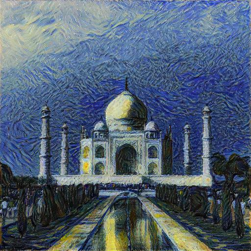

Below are some of the projects I've recently worked on. The corresponding 
code for each project can be viewed by accessing the provided Github repository.

# auralflow 🔊🎵
PyTorch-based application for training/evaluating source separation models to 
extract stems (e.g. vocals) from audio for music remixing. 

For the source code, go [here]({{ "https://github.com/wynnliam/raycore" | absolute_url }})

<i class="project-tag"> topics: <b> deep learning, signal processing, audio</b></i>

---

# neural style transfer 🎨 📷
PyTorch-based implementations (from scratch) of several distinct deep learning 
approaches (optimization, transformation networks, CycleGAN) that aim to solve 
a popular problem in computer vision called style transfer.

[//]: # (
)

[//]: # (    ![Figure]&#40;{{"/assets/img/style_transfer/img_2.jpg" | absolute_url}}&#41;)

[//]: # (    <figure>)

[//]: # (        )

[//]: # (    </figure>)

[//]: # (    )

[//]: # (    )

[//]: # (    )

[//]: # (
)

[//]: # (Put simply, the task )

[//]: # (in style transfer is to generate an image that preserves the content of image )

[//]: # (x &#40;i.e. semantics, shapes, edges, etc.&#41; while matching the style of image y )

[//]: # (&#40;i.e. textures, patterns, color, etc.&#41;. One may ask: what is the correct balance )

[//]: # (between content and style? As it turns out, the answer is more subjective than )

[//]: # (typical optimization/ML problems - "beauty is in the eye's of the beholder", )

[//]: # (as they say.)

[//]: # (A blog post diving deep into theory and implementation can be found here, and )

[//]: # (for source code, go here.)

For the source code, go [here](https://github.com/kianzohoury/style_transfer).

<i class="project-tag"> topics: <b> deep learning, image processing, generative adversarial networks</b></i>

---

# conditional VAEs for generating handwritten digits (MNIST)
Exploring conditional variational autoencoders (VAEs) for guided image generation 
of handwritten digits, using the famous [MNIST](https://en.wikipedia.org/wiki/MNIST_database) dataset. 

Source code can be found [here](https://github.com/kianzohoury/VAE).

<i class="project-tag"> topics: <b> deep learning, image processing, variational inference </b></i>

---

# ecoshopper ♻️ 🛒
AI-powered recycling assistant.

Ecoshopper was a prototype mobile web application designed as part of a 
final project for the Summer 2021 iteration of UC Berkeley's CS 160. The core 
ML design of the app involved a pretrained VGG16 backbone that served as 
a rich feature extractor for transfer learning. Using Stanford's [TrashNet](https://github.com/garythung/trashnet)
dataset along with human annotation, a downstream classifier was trained to identify recylable goods from 
non-recyclable goods. 

Model implementation and deployment were done with PyTorch and Django, and 
front-end development was done with React Native.
For the source code, go <a href="https://github.com/kianzohoury/ecoshopper">here</a>.

<i class="project-tag"> topics: <b> deep learning, image classification, app development</b></i>

---
